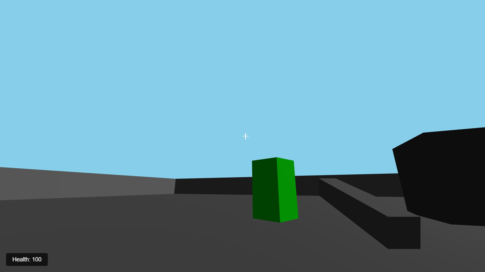

# Real-time 3D Multiplayer Game



### Run This

netsh advfirewall firewall add rule name="Flask Game Server" dir=in action=allow protocol=TCP localport=8080

A simple multiplayer game where users on the same network can move around in a 2D space using arrow keys or WASD keys.

## Features

- Real-time player movement
- Multiple players support
- Unique color for each player
- Smooth movement with arrow keys or WASD
- Players are kept within canvas bounds

## Requirements

- Python 3.x
- Flask
- Flask-SocketIO
- gevent
- gevent-websocket

## How to Run

1. Make sure all dependencies are installed:
   ```
   pip install flask flask-socketio gevent gevent-websocket
   ```

2. Run the server:
   ```
   python app.py
   ```

3. Open a web browser and navigate to:
   ```
   http://localhost:8080
   ```

4. To play with others on the same network, they can connect using your computer's IP address:
   ```
   http://YOUR_IP_ADDRESS:8080
   ```

## Controls

- Use Arrow keys or WASD keys to move your player
- Players are represented as colored circles
- Movement is confined to the canvas boundaries

## Technical Details

- Uses Flask for the web server
- WebSocket communication via Flask-SocketIO
- HTML5 Canvas for rendering
- Real-time updates using Socket.IO events
